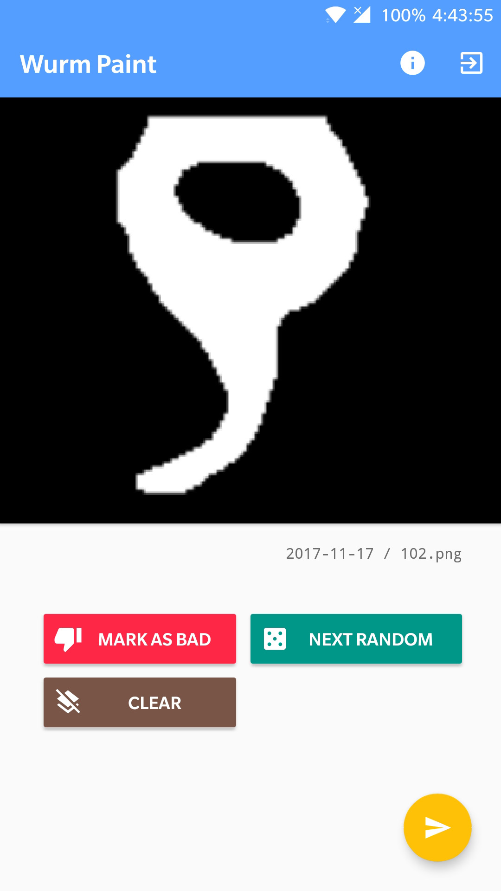

# Wurm Paint

Android drawing application for annotating the backbone of worms.

## Releases

### 1.06 (2018-03-09)
- Checks whether anything has been drawn before the user submits
- Disabled anti-aliasing
- Notify user that they have already drawn if they try to draw again
- Brings down keyboard after user attempts to login
- Added user verification
- Added user password reset

### 1.05 (2018-02-22)
- More robust email validation
- Improved password fields
- Added basic navigation drawer to access user profile
- Google Sign-in now fully supported
- Added push notification support
- Firebase analytics

### 1.04 (2018-01-24)
- Added quick options to marking bad images rather than just a general comment box
- Resolved an issue where an empty email or password login would lead to a crash

### 1.03 (2017-12-16)
- Increased image retrieval size
- Clean up and code optimization
- App takes up to 70% less space on devices

### 1.02 (2017-12-08)
- Added Firebase Crashlytics and Performance Monitoring
- Added feedback and rate app dialog
- Removed brush color functionality
- Images expanded to fill the screen
- User restricted to drawing single strokes
- User can mark images as bad and provide a reason
- Optimized for tablet displays

### 1.01 (2017-12-01)
- Lowered app requirements to be able to install on older Android devices (up to Lollipop)

### 1.0 (2017-11-19)
- Initial Release