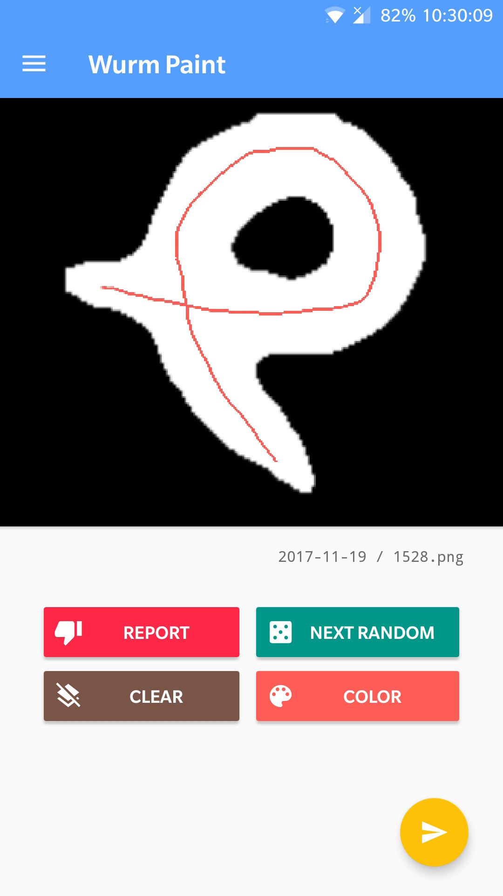
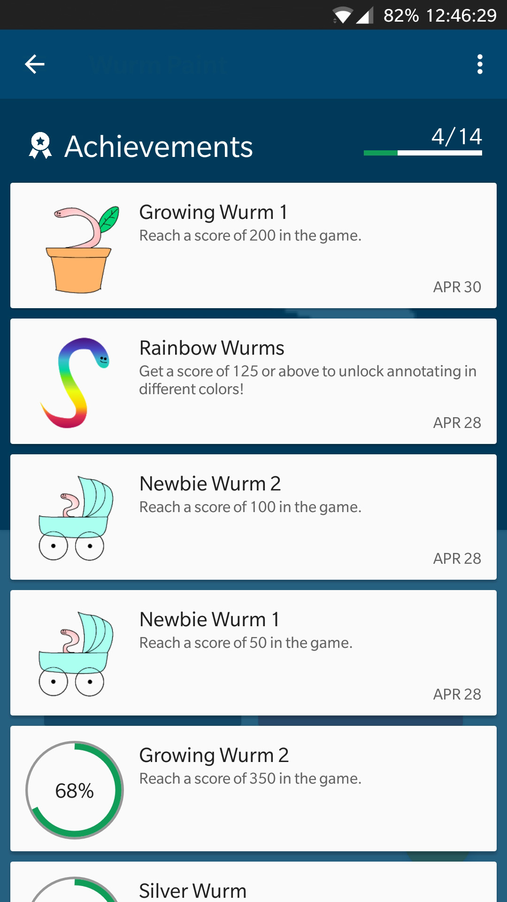
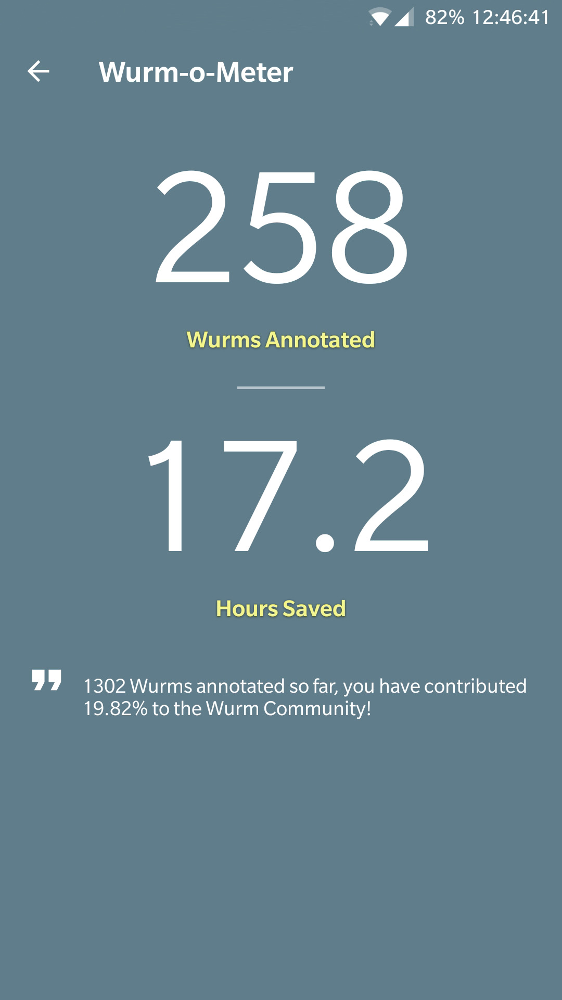

# Wurm Paint

Android drawing application for annotating the backbone of worms.

 Draw                 | Compete              | Accomplish
:--------------------:|:--------------------:|:--------------------:
||

## System Requirements
Android Lollipop (5.0) or higher
Software has been tested on Android Lollipop, Marshmallow, Nougat and Oreo

## Installation of Demo
Visit the [Google Play Store](https://play.google.com/store/apps/details?id=com.caden.drawing.wurmpaint) on your Android device to install. Installation takes less than a minute on most devices, and images from our cloud-based dataset should load in < 1s on most WiFi networks.

## App reproduction with novel data
Please see our [wiki](https://github.com/jiangshen/WurmPaint/wiki) for instructions.

## Releases

### 2.03 (2018-05-09)
- Added Help screen
- Added Wurm Logbook to display drawing history
- Updated app icon
- Updated notification icon
- Updated Navigation Drawer profile icon
- Fixed an issue on some phones where pressing the Settings back button does not correctly go back to the drawing screen
- Disabled controls when sending images 

### 1.09 (2018-4-28)
- Updated Achievements scoring
- Updated LeaderBoard submissions
- User can now draw in different colors
- Added color wheel type in settings
- Added Wurm-o-Meter screen with user scores
- Added Colorful Wurms achievement that unlocks color annotation

### 1.08 (2018-04-23)
- Added About screen
- Redesigned navigation drawer layout
- Added user preferences
- Update navigation drawer based on whether user is signed in via Google or otherwise
- App automatically signs out if Google Account is signed out.
- Added more Google Play Achievements

### 1.07 (2018-04-14)
- Added user scores in FireBase
- More robust image loading from FireBase
- Navigation menu support
- Added Google Play Achievements
- Added Google Play Leaderboard
- Added line information (pixel accuracy) on FireBase database
- Updated Play Services to v15.0.0

### 1.06 (2018-03-09)
- Checks whether anything has been drawn before the user submits
- Disabled anti-aliasing
- Notify user that they have already drawn if they try to draw again
- Brings down keyboard after user attempts to login
- Added user verification
- Added user password reset

### 1.05 (2018-02-22)
- More robust email validation
- Improved password fields
- Added basic navigation drawer to access user profile
- Google Sign-in now fully supported
- Added push notification support
- FireBase analytics

### 1.04 (2018-01-24)
- Added quick options to marking bad images rather than just a general comment box
- Resolved an issue where an empty email or password login would lead to a crash

### 1.03 (2017-12-16)
- Increased image retrieval size
- Clean up and code optimization
- App takes up to 70% less space on devices

### 1.02 (2017-12-08)
- Added FireBase Crashlytics and Performance Monitoring
- Added feedback and rate app dialog
- Removed brush color functionality
- Images expanded to fill the screen
- User restricted to drawing single strokes
- User can mark images as bad and provide a reason
- Optimized for tablet displays

### 1.01 (2017-12-01)
- Lowered app requirements to be able to install on older Android devices (up to Lollipop)

### 1.0 (2017-11-19)
- Initial Release
